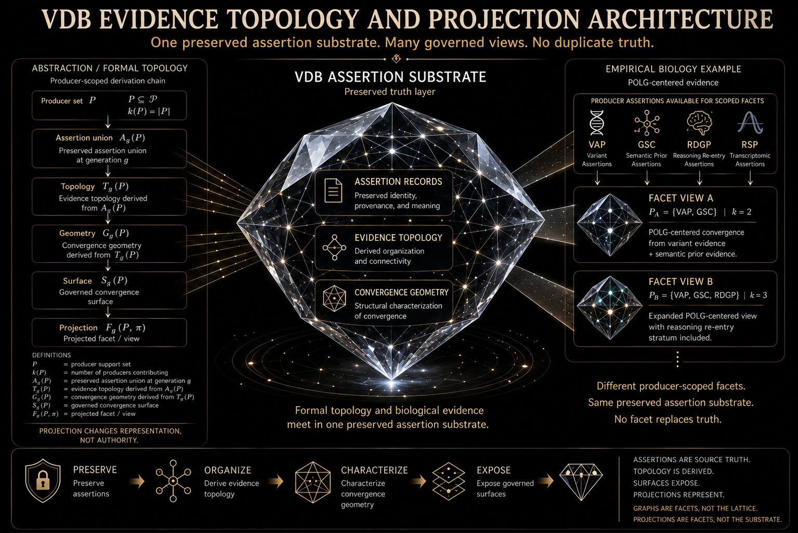
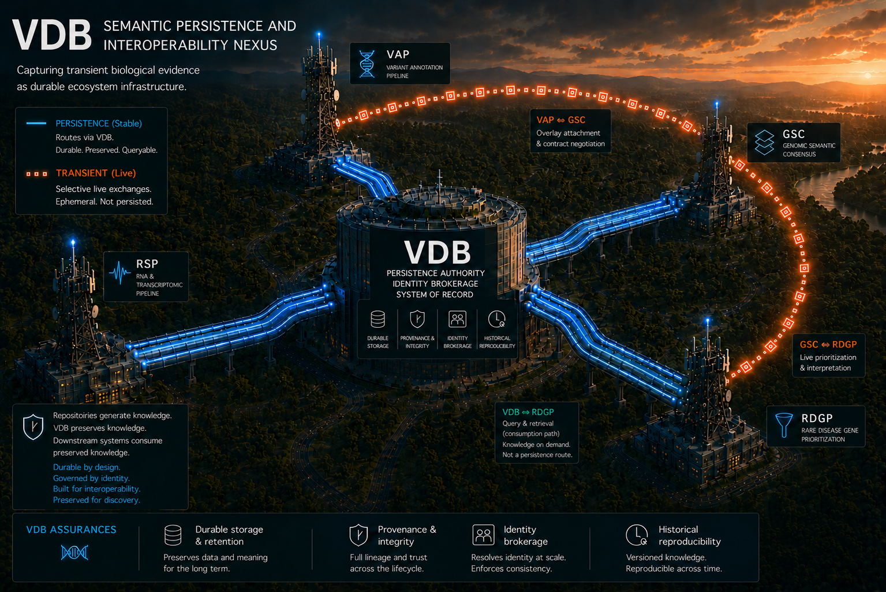
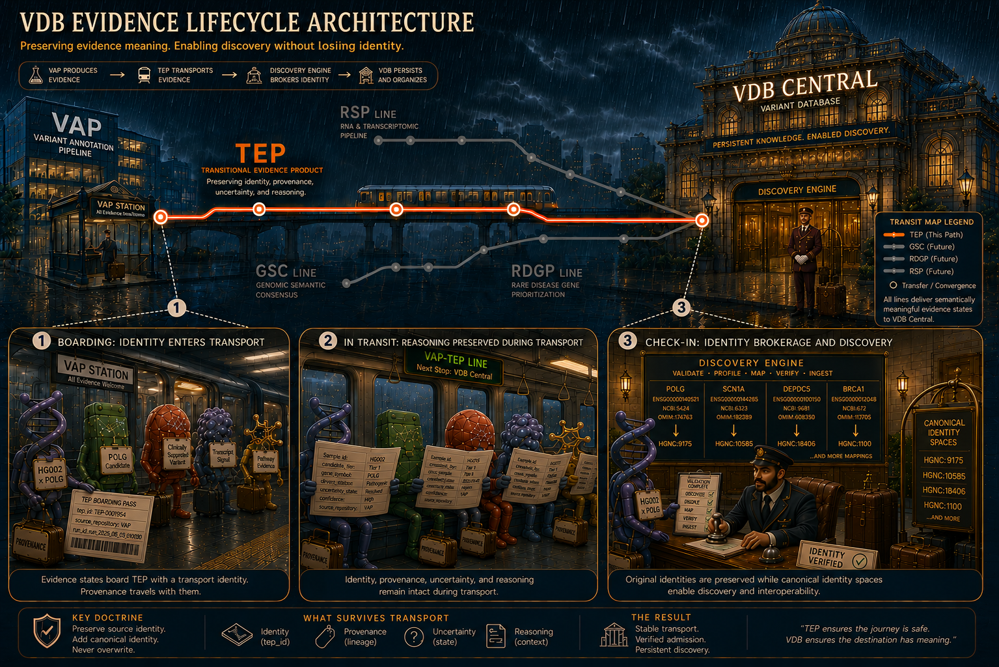

# Variant Database (VDB)

**VDB is a genomic evidence database for preserving, validating, and organizing outputs from bioinformatics pipelines.**

Most variant databases focus on storing final calls or annotations. VDB is built for the messier layer underneath: the evidence packages, run metadata, provenance records, coordinates, feature annotations, validation receipts, and identity mappings that make genomic data reproducible and interpretable.

  

<em>VDB organizes heterogeneous genomic evidence into topology-ready substrates for downstream analysis.</em>

## What VDB Demonstrates

VDB is part of a broader computational biology portfolio, but this repository has a specific purpose: it shows how producer outputs from independent bioinformatics pipelines can be registered, preserved, validated, and prepared for downstream reasoning without collapsing away scientific context.

Current implementation highlights include:

- **Python/SQLite evidence registration** for structured genomic evidence packages.
- **Producer-aware data modeling** across variant-level and phenotype-gene evidence sources.
- **Metadata, coordinate, and feature preservation** so noncoding, intergenic, unannotated, and currently ambiguous variants remain available for future reinterpretation.
- **Provenance-first validation** using manifests, artifact inventories, lineage metadata, readiness checks, and non-mutation safeguards.
- **Assertion Records and conservative Evidence Topology** for organizing preserved evidence without claiming clinical interpretation or diagnostic actionability.
- **253 passing pytest tests** spanning unit tests, golden fixtures, and MARK/HPC-executed smoke-test workflows.

## Why This Is Not a Typical Variant Database

A conventional variant database can store rows of variant annotations. VDB is designed to preserve the evidence structure around those rows.

| Typical variant table | VDB approach |
| --- | --- |
| Stores selected variant calls or annotations | Registers full evidence products from upstream pipelines |
| Treats annotations as final rows | Preserves observation, normalization, interpretation, prioritization, validation, and context layers |
| Often centers gene symbols or final labels | Preserves source identities, namespaces, coordinates, features, and producer-specific identifiers |
| May lose run context and provenance | Stores manifests, validation receipts, lineage metadata, and source artifact references |
| Usually focuses on currently interpretable variants | Keeps noncoding, intergenic, unannotated, and ambiguous evidence available for future analysis |

The central design principle is simple: **scientific software claims need receipts.** VDB is built so claims about corpus scope, ingestion status, evidence identity, and topology readiness are backed by concrete artifacts and executable tests.

## Evidence Products in Scope

VDB currently focuses on two producer families from companion repositories in this portfolio ecosystem.

A **TEP** (*Transportable Evidence Product*) is a structured evidence package emitted by an upstream pipeline. It may include machine-readable payloads, source artifact manifests, validation reports, provenance metadata, and producer-owned evidence roles.

| Producer | Evidence shape | VDB role |
| --- | --- | --- |
| **VAP** | Sample/run-specific variant evidence lifecycles, including observation, normalization, coding and noncoding interpretation, prioritization, validation, and run context | Preserve variant-derived evidence, source identities, reference-context coordinates, feature declarations, and lifecycle provenance |
| **GSC** | Phenotype-scoped semantic priors for phenotype-gene relationships | Preserve semantic-prior evidence, gene namespace, phenotype scope, source attribution, scoring context, and provenance |

These products are intentionally different. VDB does not force them into a single flat schema. It preserves each producer's authority boundaries while creating durable substrates for cross-evidence organization.

  

## Current Implementation Status

VDB is in active pre-v1.0 development. The implemented system has moved beyond initial ingestion into late Phase 4 work: converting producer TEPs into durable, topology-ready evidence substrates.

Implemented and validated layers include:

1. **TEP-aware registration** for producer evidence packages.
2. **SQLite-backed Registration Units** for package artifacts, assertions, identities, metadata, coordinates, and feature declarations.
3. **Registration Unit validation** with read-only source handling and non-mutation checks.
4. **Corpus Generation** from governed input policies and selection manifests.
5. **Assertion Record generation** preserving producer scientific claims and referencing large identity/declaration sets through deterministic handles.
6. **Conservative Evidence Topology** deriving organization over preserved evidence without overclaiming biological or clinical interpretation.

The current test suite contains **253 passing pytest tests** across the implemented VDB codebase and fixture/documentation context.

## Benchmark Corpus

The near-term v1.0 benchmark centers on a six-TEP multi-producer corpus:

- **4 VAP TEPs**: HG002 WGS plus representative epilepsy WES packages at q1, median, and q3 depth tiers.
- **2 GSC TEPs**: epilepsy and mitochondrial disease semantic-prior packages.

This benchmark is deliberately heterogeneous. It demonstrates that VDB can preserve both production-scale variant evidence and compact phenotype-gene semantic priors under a shared registration, assertion-record, and topology-ready architecture.

Future corpus expansion may include the remaining completed VAP TEPs and a larger epilepsy WES corpus after the first public VDB release stabilizes.

## Reproducibility and Validation

VDB treats reproducibility as an architectural requirement, not a post-hoc documentation task.

Evidence claims are supported by:

- input policies and selection manifests for benchmark corpora,
- deterministic artifact inventories,
- validation reports and readiness tables,
- source identity and declaration-set handles,
- golden fixtures,
- pytest coverage across implementation layers,
- MARK/HPC smoke-test outputs on real producer evidence.

The goal is not only to make evidence queryable. The goal is to make the path from producer output to downstream substrate inspectable, reproducible, and safe to audit.

  

## Repository Layout

| Path | Purpose |
| --- | --- |
| `src/variant_database/` | Core Python implementation for registration, persistence, corpus generation, assertion records, and topology derivation |
| `scripts/` | Operational scripts, validation utilities, MARK/HPC smoke-test drivers, and development helpers |
| `tests/` | Unit tests, integration tests, and golden-fixture tests |
| `tests/fixtures/` | Synthetic and golden evidence fixtures used for reproducible validation |
| `docs/architecture/` | System architecture and authority models |
| `docs/contracts/` | System contracts and boundary definitions |
| `docs/design/` | Design rationale and conceptual models |
| `docs/implementation/` | Implementation specifications and schema-facing documentation |
| `docs/validation/` | Validation receipts and certification summaries |
| `docs/manifests/` | Governed corpus policies and selection manifests |
| `results/` | Generated validation and Phase 4 development outputs |

## Documentation Starting Points

For a quick orientation, start with:

- [`docs/NAMESPACE.md`](docs/NAMESPACE.md) — documentation namespace overview.
- [`docs/maps/milestone_map.md`](docs/maps/milestone_map.md) — development phases and repository roadmap.
- [`docs/contracts/system_contract.md`](docs/contracts/system_contract.md) — system responsibilities and boundaries.
- [`docs/architecture/namespace_authority_model.md`](docs/architecture/namespace_authority_model.md) — namespace and authority model.
- [`docs/implementation/specifications/vap_coordinate_feature_registration_spec.md`](docs/implementation/specifications/vap_coordinate_feature_registration_spec.md) — VAP metadata, coordinate, and feature declaration registration.
- [`docs/validation/`](docs/validation/) — validation summaries and receipts.

The root README is intentionally lightweight. Detailed design, contracts, validation summaries, and implementation specifications live in the documentation tree.

## Roadmap

Near-term work is focused on completing the transition from preserved evidence topology toward downstream evidence surfaces:

- resume namespace mediation after full modern six-TEP receipts are available,
- complete convergence geometry over topology-derived relationships,
- define projection views for downstream consumers,
- expose RDGP-facing query surfaces,
- continue hardening noncoding-aware evidence preservation,
- expand benchmark coverage after v1.0 stabilization.

## Non-Goals

VDB is not a clinical decision-support system, diagnostic classifier, or pathogenicity caller. It does not claim that a variant causes disease, that a gene is clinically actionable, or that a downstream prioritization is medically valid.

Its role is narrower and more foundational: preserve genomic evidence, identity, provenance, reference context, and topology-ready structure so downstream reasoning systems can operate on auditable substrates.

## Project Status

VDB is under active development as part of a broader computational biology repository ecosystem. The current implementation is best understood as a pre-v1.0 genomic evidence infrastructure project with validated registration, assertion-record, and conservative topology layers.
